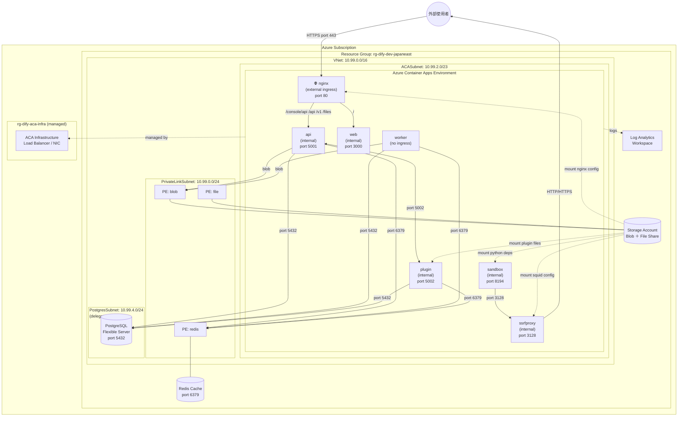

# Dify Azure 服務架構圖

## 整體架構



---

## 網路流量說明

### 對外流量（Ingress）

| 路徑 | 說明 |
|------|------|
| 外部 → nginx:80 | 唯一對外入口，ACA External Ingress |
| nginx → api:5001 | `/console/api`、`/api`、`/v1`、`/files` |
| nginx → web:3000 | `/`（所有其他路徑） |

### 服務間通訊（內部）

| 來源 | 目標 | Port | 用途 |
|------|------|------|------|
| api | PostgreSQL | 5432 | 讀寫應用資料 / 向量資料 |
| api | Redis | 6379 | Session、Celery 任務佇列 |
| api | Storage Blob | 443 | 檔案上傳 / 下載 |
| api | plugin | 5002 | 插件呼叫 |
| worker | PostgreSQL | 5432 | 背景任務讀寫 |
| worker | Redis | 6379 | Celery broker |
| worker | Storage Blob | 443 | 檔案處理 |
| plugin | PostgreSQL | 5432 | 插件資料存取 |
| plugin | Redis | 6379 | 插件快取 |
| sandbox | ssrfproxy | 3128 | 程式碼執行時的對外 HTTP/HTTPS 請求 |

### 私有端點（Private Endpoints）

| Private Endpoint | 對應服務 | 子網路 |
|------------------|---------|--------|
| pe-blob | Storage Account（Blob） | PrivateLinkSubnet |
| pe-file | Storage Account（File） | PrivateLinkSubnet |
| pe-redis | Redis Cache | PrivateLinkSubnet |

> PostgreSQL 直接部署在 PostgresSubnet（VNet delegation），不走 Private Endpoint

### 掛載（File Share Mount）

| File Share | 掛載到 | 內容 |
|-----------|--------|------|
| nginx | nginx container | nginx.conf、default.conf、proxy.conf |
| ssrfproxy | ssrfproxy container | squid.conf |
| sandbox | sandbox container | python-requirements.txt |
| pluginstorage | plugin container | 插件檔案 |

---

## Resource Group 說明

| Resource Group | 內容 | 建立方式 |
|---------------|------|---------|
| `rg-dify-dev-japaneast` | 所有 Dify 服務資源 | Bicep 建立 |
| `rg-dify-aca-infra` | ACA 底層基礎設施（LB、NIC） | Azure 自動建立 |
| `NetworkWatcherRG` | Network Watcher | Azure 自動建立 |

---

## 子網路設計

```
VNet: 10.99.0.0/16
├── PrivateLinkSubnet  10.99.0.0/24  → Private Endpoints 專用
├── ACASubnet          10.99.2.0/23  → Container Apps（/23 = 512 IP）
└── PostgresSubnet     10.99.4.0/24  → PostgreSQL（VNet delegation）
```
