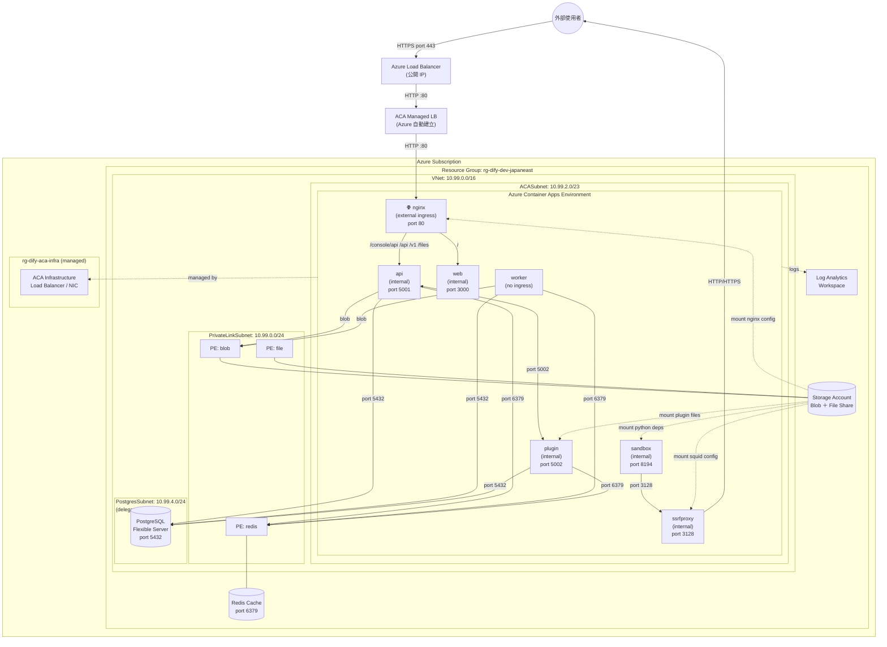

# Dify Azure 服務架構圖

## 整體架構


```mermaid
graph TB
    User((外部使用者))
    alb["Azure Load Balancer\n(公開 IP)"]
    acalb["ACA Managed LB\n(Azure 自動建立)"]

    User -->|HTTPS port 443| alb
    alb -->|HTTP :80| acalb
    acalb -->|HTTP :80| nginx

    subgraph sub["Azure Subscription"]
        subgraph rg["Resource Group: rg-dify-dev-japaneast"]

            subgraph vnet["VNet: 10.99.0.0/16"]

                subgraph acasubnet["ACASubnet: 10.99.2.0/23"]
                    subgraph acaenv["Azure Container Apps Environment"]
                        nginx["🌐 nginx\n(external ingress)\nport 80"]
                        api["api\n(internal)\nport 5001"]
                        web["web\n(internal)\nport 3000"]
                        worker["worker\n(no ingress)"]
                        sandbox["sandbox\n(internal)\nport 8194"]
                        ssrfproxy["ssrfproxy\n(internal)\nport 3128"]
                        plugin["plugin\n(internal)\nport 5002"]
                    end
                end

                subgraph plsubnet["PrivateLinkSubnet: 10.99.0.0/24"]
                    pe_blob["PE: blob"]
                    pe_file["PE: file"]
                    pe_redis["PE: redis"]
                end

                subgraph pgsubnet["PostgresSubnet: 10.99.4.0/24\n(delegated)"]
                    postgresql[("PostgreSQL\nFlexible Server\nport 5432")]
                end

            end

            storage[("Storage Account\nBlob ＋ File Share")]
            redis[("Redis Cache\nport 6379")]
            loga["Log Analytics\nWorkspace"]
        end

        subgraph inframrg["rg-dify-aca-infra (managed)"]
            infra["ACA Infrastructure\nLoad Balancer / NIC"]
        end
    end

    %% Nginx routing
    nginx -->|"/console/api /api /v1 /files"| api
    nginx -->|"/"| web

    %% API connections
    api -->|port 5432| postgresql
    api -->|port 6379| pe_redis
    api -->|blob| pe_blob
    api <-->|port 5002| plugin

    %% Worker connections
    worker -->|port 5432| postgresql
    worker -->|port 6379| pe_redis
    worker -->|blob| pe_blob

    %% Plugin connections
    plugin -->|port 5432| postgresql
    plugin -->|port 6379| pe_redis

    %% Sandbox SSRF proxy
    sandbox -->|port 3128| ssrfproxy
    ssrfproxy -->|HTTP/HTTPS| User

    %% Private endpoints to storage/redis
    pe_blob --- storage
    pe_file --- storage
    pe_redis --- redis

    %% File shares mount
    storage -.->|mount nginx config| nginx
    storage -.->|mount squid config| ssrfproxy
    storage -.->|mount python deps| sandbox
    storage -.->|mount plugin files| plugin

    %% Logging
    acaenv -.->|logs| loga

    %% ACA infra
    acaenv -.->|managed by| infra
```

---

## 網路流量說明

### 對外流量（Ingress）

| 路徑 | 說明 |
|------|------|
| 外部 → nginx:80 | 唯一對外入口，ACA External Ingress |
| nginx → api:5001 | `/console/api`、`/api`、`/v1`、`/files` |
| nginx → web:3000 | `/`（所有其他路徑） |

### 服務間通訊（內部）

| 來源 | 目標 | Port | 用途 |
|------|------|------|------|
| api | PostgreSQL | 5432 | 讀寫應用資料 / 向量資料 |
| api | Redis | 6379 | Session、Celery 任務佇列 |
| api | Storage Blob | 443 | 檔案上傳 / 下載 |
| api | plugin | 5002 | 插件呼叫 |
| worker | PostgreSQL | 5432 | 背景任務讀寫 |
| worker | Redis | 6379 | Celery broker |
| worker | Storage Blob | 443 | 檔案處理 |
| plugin | PostgreSQL | 5432 | 插件資料存取 |
| plugin | Redis | 6379 | 插件快取 |
| sandbox | ssrfproxy | 3128 | 程式碼執行時的對外 HTTP/HTTPS 請求 |

### 私有端點（Private Endpoints）

| Private Endpoint | 對應服務 | 子網路 |
|------------------|---------|--------|
| pe-blob | Storage Account（Blob） | PrivateLinkSubnet |
| pe-file | Storage Account（File） | PrivateLinkSubnet |
| pe-redis | Redis Cache | PrivateLinkSubnet |

> PostgreSQL 直接部署在 PostgresSubnet（VNet delegation），不走 Private Endpoint

### 掛載（File Share Mount）

| File Share | 掛載到 | 內容 |
|-----------|--------|------|
| nginx | nginx container | nginx.conf、default.conf、proxy.conf |
| ssrfproxy | ssrfproxy container | squid.conf |
| sandbox | sandbox container | python-requirements.txt |
| pluginstorage | plugin container | 插件檔案 |

---

## Resource Group 說明

| Resource Group | 內容 | 建立方式 |
|---------------|------|---------|
| `rg-dify-dev-japaneast` | 所有 Dify 服務資源 | Bicep 建立 |
| `rg-dify-aca-infra` | ACA 底層基礎設施（LB、NIC） | Azure 自動建立 |
| `NetworkWatcherRG` | Network Watcher | Azure 自動建立 |

---

## 子網路設計

```
VNet: 10.99.0.0/16
├── PrivateLinkSubnet  10.99.0.0/24  → Private Endpoints 專用
├── ACASubnet          10.99.2.0/23  → Container Apps（/23 = 512 IP）
└── PostgresSubnet     10.99.4.0/24  → PostgreSQL（VNet delegation）
```

---

## Request 流程

### 同步 API 呼叫

```
Client
  │ HTTPS
  ▼
Azure Load Balancer（公開 IP，Layer 4）
  │ TCP :80 / :443
  ▼
ACA Managed Load Balancer（Azure 自動建立，ACA 環境入口）
  │ HTTP :80
  ▼
nginx（ACASubnet）
  │ 依 URL path 轉發
  ├─ /api/* /console/api/* → api:5001（TCP，ACA internal DNS）
  └─ /*                    → web:3000（TCP，ACA internal DNS）
          │
          ▼
        api（ACASubnet, port 5001）
          │
          ├──→ PostgreSQL:5432（PostgresSubnet，VNet 直連，subnet delegation）
          │       用途：讀寫 app 資料、user session、workflow 定義
          │
          ├──→ Redis:6379（PrivateLinkSubnet → pe-redis → Redis PaaS）
          │       用途：快取、rate limiting、session token
          │
          ├──→ sandbox:8194（ACA internal，有使用 Code 節點時）
          │       sandbox → ssrfproxy:3128 → 外部 HTTP（SSRF 防護）
          │
          ├──→ plugin:5002（ACA internal，有使用 Plugin 時）
          │       plugin → PostgreSQL（plugin 自己也讀 DB）
          │       plugin → Redis
          │
          └──→ Azure Blob（PrivateLinkSubnet → pe-blob → Storage PaaS）
                  用途：讀取 / 上傳使用者檔案、模型結果
```

### 非同步任務（RAG、文件索引、長時間 Workflow）

```
Client
  │
  ▼
nginx → api
          │
          ├─ 1. 寫任務到 Redis DB:1（Celery broker queue）
          └─ 2. 立即回傳 task_id（202 Accepted）

          ↓ 同時間

worker / extra-worker（ACASubnet）
  │  從 Redis DB:1 pull Celery task
  │
  ├──→ PostgreSQL:5432
  │       用途：讀取 workflow 設定、寫回執行結果
  │
  ├──→ pgvector（同一個 PostgreSQL，vectorDb）
  │       用途：RAG 向量搜尋 / 寫入 embedding
  │
  ├──→ Redis DB:0
  │       用途：寫任務進度、pub/sub 通知前端
  │
  ├──→ Azure Blob（pe-blob）
  │       用途：讀取上傳的文件、寫回處理結果
  │
  ├──→ sandbox:8194（若任務含 Code 節點）
  └──→ plugin:5002（若任務含 Plugin）

Client 後續輪詢：
  GET /task/{task_id} → nginx → api → Redis 查進度
```

### DNS 解析路徑

| 目的地 | 解析方式 |
|--------|---------|
| `api`, `sandbox`, `plugin`, `web`, `ssrfproxy` | ACA 內部 DNS，走 ACASubnet |
| `*.redis.cache.windows.net` | Private DNS Zone → pe-redis NIC IP（PrivateLinkSubnet） |
| `*.blob.core.windows.net` | Private DNS Zone → pe-blob NIC IP（PrivateLinkSubnet） |
| `*.file.core.windows.net` | Private DNS Zone → pe-file NIC IP（PrivateLinkSubnet） |
| PostgreSQL FQDN | 直接走 PostgresSubnet（VNet injection，不使用 PE） |

---

## 公開 Load Balancer 鎖定方案

ACA 環境設定 `internal: false`，Azure 自動建立一個公開 LB，只有 nginx（`external: true`）掛在上面。以下三種方式可控制存取：

### 選項 1：ACA Ingress IP Restrictions（最快）

直接在 nginx ingress 加 `ipSecurityRestrictions`，不需額外資源：

```bicep
ipSecurityRestrictions: [
  {
    name: 'allow-office'
    action: 'Allow'
    ipAddressRange: '203.0.113.0/24'
  }
  {
    name: 'deny-all'
    action: 'Deny'
    ipAddressRange: '0.0.0.0/0'
  }
]
```

適合：內部工具、固定 IP 使用者  
限制：無 WAF，IP 動態時難維護

### 選項 2：ACA Internal + Application Gateway（企業等級）

```
Internet → AppGW（公開 IP, WAF） → ACA Internal LB → nginx
```

將 ACA 環境改為 `internal: true`，完全隱藏在 VNet 內，AppGW 負責公開 IP、SSL termination、WAF、IP 白名單。  
成本：AppGW WAF_v2 約 $300+/月  
適合：對外 B2B、需要安全稽核

### 選項 3：Azure Front Door（CDN + WAF）

```
Internet → Front Door（全球 PoP, WAF） → ACA nginx
```

保持 ACA `internal: false`，在 nginx ingress 限制只允許 Front Door service tag：

```bicep
ipSecurityRestrictions: [
  {
    name: 'allow-frontdoor'
    action: 'Allow'
    ipAddressRange: 'AzureFrontDoor.Backend'
  }
  {
    name: 'deny-all'
    action: 'Deny'
    ipAddressRange: '0.0.0.0/0'
  }
]
```

適合：對外 B2C、全球用戶、需要 CDN 加速

### 方案比較

| | IP Restrictions | Application Gateway | Front Door |
|--|--|--|--|
| 設定複雜度 | 低 | 高 | 中 |
| WAF | 無 | 有 | 有 |
| CDN | 無 | 無 | 有 |
| 額外成本 | 無 | ~$300+/月 | ~$150+/月 |
| 適合情境 | 內部工具 | B2B | B2C |
